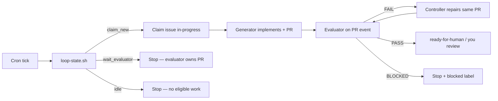

# Cross-project agent automation (loop engineering)

Wayfarer and ECAS use automated controller/evaluator loops. Cursor handles the
controller and immediate PR-event evaluator; Codex provides Wayfarer's scheduled
recovery watchdog. You do not manually pick issues — cron wakes the controller,
which runs `scripts/loop-state.sh` and follows the action.

Schedules are staggered so the two repos never start agent work at the same time.

## Schedule (local time)

| Project | Automation | Trigger | Times |
| --- | --- | --- | --- |
| ECAS | ECAS controller loop | Cron | 9:00, 12:00, 15:00, 18:00 (`0 9,12,15,18 * * *`) |
| ECAS | ECAS evaluator | PR opened / pushed | Immediate on PR activity |
| Wayfarer | Wayfarer controller loop | Cron | 9:30, 12:30, 15:30, 18:30 (`30 9,12,15,18 * * *`) |
| Wayfarer | Wayfarer evaluator | PR opened / pushed | Immediate on PR activity |
| Wayfarer | Codex evaluator watchdog | Cron | 10:00, 13:00, 16:00, 19:00 Europe/Madrid |

Minimum gap between ECAS and Wayfarer controller ticks: **30 minutes**.

## Loop flow (both projects)



## Wayfarer automations

Save the controller and immediate evaluator in Cursor Automations (repo:
`caraseli02/ai-travel-spatial-workspace`, branch: `main`). Configure the watchdog
as the Codex automation described below.

### 1. Wayfarer controller loop

- **Model**: Composer 2.5
- **Tools**: Comment on PRs
- **Schedule**: `30 9,12,15,18 * * *`
- **Instructions**: run `make loop-prompt` output, or paste from `scripts/loop-controller-prompt.sh`

The controller **never asks which issue to work on**. It runs `bash scripts/loop-state.sh` and routes:

| Action | Behavior |
| --- | --- |
| `claim_new` | Claim via `scripts/claim-issue.sh`, implement, open PR |
| `continue` | Finish in-progress issue (no PR yet) |
| `repair` | Fix same branch/PR from evaluator FAIL |
| `wait_evaluator` | Stop — evaluator owns the open PR |
| `idle` | Stop — queue empty or all blocked |

### 2. Wayfarer evaluator

- **Model**: Claude Sonnet 5 (thinking)
- **Tools**: Comment on PRs
- **Trigger**: PR opened + code pushed (ignore drafts)
- **Instructions**: `bash scripts/loop-evaluator-prompt.sh`

Posts structured PASS/FAIL/BLOCKED per `docs/agents/autonomous-workflow.md`. Does not merge.

### 3. Codex evaluator watchdog

- **Automation**: `Wayfarer PR evaluator watchdog`
- **Model**: `gpt-5.6-sol` (high reasoning)
- **Schedule**: 10:00, 13:00, 16:00, 19:00 Europe/Madrid
- **Execution**: isolated Codex worktree
- **Scope**: oldest open non-draft PR without a trusted verdict for its current head; at most one PR per run

This is a reconciliation path, not a second opinion on an already evaluated head. It skips new heads for 15 minutes, waits for pending CI/mergeability, reuses a trusted current-head verdict without reposting, and may only comment or reconcile `in-progress`, `ready-for-human`, and `blocked` labels.

## ECAS (reference)

1. **ECAS controller loop** — `0 9,12,15,18 * * *`, `caraseli02/Ecas`
2. **ECAS evaluator** — PR opened/pushed

Harness: `docs/agents/autonomous-workflow.md` in the Ecas repo. Evidence: `cronjob:77c73e447150` in `feature_list.json`.

## Local SDK fallback (optional)

Cloud Automations are the primary loop. For manual triggers on your Mac:

```bash
export CURSOR_API_KEY="your-key"
make loop-state    # what would the controller do?
make loop-prompt   # full controller instructions + current state
make loop-run      # run controller locally (same contract as cron)
```

Tech-debt-only picker (subset): `make debt-next` / `make debt-agent`.

Launchd example (offset schedule): `scripts/com.wayfarer.agent-loop.plist.example` runs `make loop-run`.

## Guardrails

- **WIP=1** — one issue per loop
- **No auto-merge** — you review PASS PRs
- **No manual issue picking** when the loop is active
- **Respect blockers** — picker and state machine skip blocked issues
- **Never pick `ready-for-human`** issues

## Related docs

- `docs/agents/autonomous-workflow.md` — planner/generator/evaluator contract
- `docs/agents/issue-tracker.md` — claim protocol
- `.cursor/rules/loop-agent.mdc` — IDE rule for loop sessions
- `docs/agents/tech-debt-queue.md` — tech-debt subset picker
