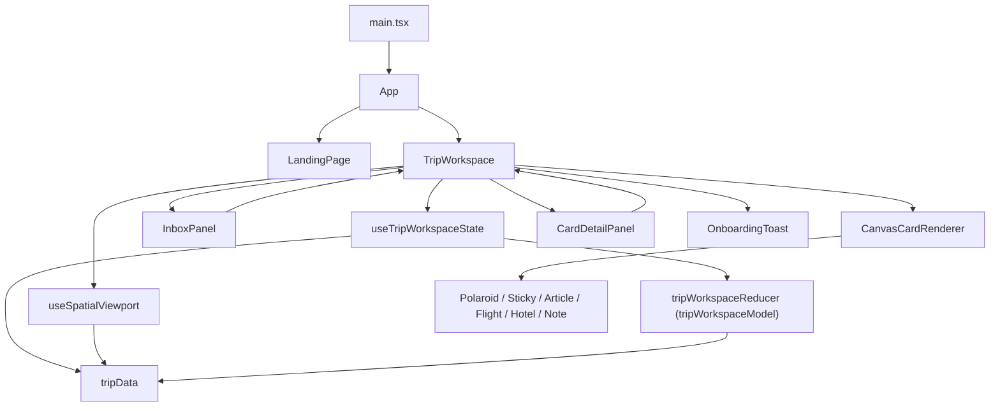

# Codebase Map

This map describes the current Wayfarer prototype at a high level. It uses the domain vocabulary from `CONTEXT.md`.

## Top Layer

`src/App.tsx` is a two-screen router. It switches between the marketing/demo entry screen and the Trip Workspace:

- `landing` renders `LandingPage`
- `app` renders `TripWorkspace`

`src/components/LandingPage.tsx` is mostly a product/demo shell. It animates sample Trip Material and hands off into the Trip Workspace through `onEnterDemo`.

## Domain Model

`src/data/tripData.ts` is the current domain seed. It defines:

- `InboxItem`: raw Trip Material from WhatsApp, links, notes, flights, and hotels
- `CanvasCard`: organized travel objects on the Spatial Canvas
- `DayCluster`: the older day-level itinerary grouping interface
- `inboxItems`, `canvasCards`, `dayGroups`, `connections`: the initial Kyoto trip state

This file is acting as fixture data and as part of the implicit domain schema. New Trip Workspace behavior should prefer the model types in `src/models/tripWorkspaceModel.ts` when describing mutable workspace transitions.

`src/models/tripWorkspaceModel.ts` is the Trip Workspace behavior module. It owns the pure `tripWorkspaceReducer` and deterministic state transitions that can be tested without rendering React:

- `tripWorkspaceReducer`: handles 19 distinct semantic state transitions (adding inbox items, promoting items to canvas cards, card deletions, manual card creation, connection linking sessions, custom days, and mock AI prompts).
- `buildInboxItem`: classifies pasted Trip Material into an Inbox Item.
- `buildProcessedCanvasCard`: marks an Inbox Item processed, creates the corresponding Canvas Card, places it near a Day Label, and returns the optional dynamic Connection.
- `applyAiPromptToTripWorkspace`: applies the mocked AI Prompt effects for Day 5 planning, Arashiyama ryokan suggestions, Gion restaurant suggestions, and fallback AI answer cards.
- `getCardCenter`: computes Connection endpoints from Canvas Card dimensions.

`src/models/tripWorkspaceModel.test.ts` contains characterization tests for this module.

## State Coordinator & Viewport Hooks

To decouple complex viewport physics and deep React state orchestration from rendering layout:

- `src/hooks/useTripWorkspaceState.ts` (`useTripWorkspaceState`): coordinates all application state transitions by wrapping the pure `tripWorkspaceReducer` under React `useReducer`. It exposes neat, typed action handlers (e.g. `addInboxItem`, `processInboxItem`, `deleteCard`, `addCustomDay`, `createManualCard`, `startLinking`).
- `src/hooks/useSpatialViewport.ts` (`useSpatialViewport`): isolates mouse/touch event listeners and normalizations, panning and zoom scale boundaries, screen-to-canvas mathematical coordinate translations, and card-dragging physics.

Both hooks are covered by comprehensive unit tests (`useSpatialViewport.test.ts` and `tripWorkspaceModel.test.ts`).

## Main Workspace

`src/components/TripWorkspace.tsx` is the orchestration module. It acts as a thin presentation view that mounts our custom hooks and binds their state and physics APIs to the rendering tree:

- Delegates active viewport dimensions, panning offsets, zoom scaling, and dragging events to `useSpatialViewport`.
- Delegates Inbox Items, Canvas Cards, Day Groups, and dialog/modal states to `useTripWorkspaceState`.
- Renders SVGs for connection lines, maps over card arrays to render cards, and loads the `InboxPanel` and dialog panels.

The main flows are:

1. Inbox capture: `handleAddItem` dispatches to `addInboxItem`.
2. Inbox organization: `handleProcessItem` dispatches to `processInboxItem`.
3. AI Prompt handling: `handleSendQuery` dispatches to `sendAiQuery`.
4. Canvas editing: card deletion, position updates, and modal/dialog states invoke hook callbacks directly.
5. Manual creation: manual card creation dispatches to `createManualCard`.

## Rendering Modules

`src/components/CanvasCards.tsx` is a Canvas Card renderer dispatcher. It converts `CanvasCard.type` into one of six visual shapes:

- `polaroid`
- `sticky`
- `article`
- `flight`
- `hotel`
- `note`

It is presentation-focused and receives card position and drag state from `TripWorkspace`.

`src/components/InboxPanel.tsx` renders the Inbox Item list. It does not own the source of truth; it calls back into `TripWorkspace` through `onAddItem`, `onProcessItem`, and `onOpenAddManual`.

`src/components/CardDetailPanel.tsx` edits the selected Canvas Card. It keeps local edit fields in sync with the selected card, then pushes changes back through `onUpdateCard`.

## Current Shape

The app is highly decoupled, robust, and unit-tested:
1. **Domain State Coordinator (`tripWorkspaceReducer`)**: Completely separate from the UI layer. Fully unit-tested and verified.
2. **Physics Layer (`useSpatialViewport`)**: Math translations and scale limits are purely isolated, eliminating event leakage.
3. **Orchestrator (`TripWorkspace`)**: Focused purely on styling, rendering layout, CSS animations, and structure.

This clean candidate architecture makes the codebase extremely testable, performant, and resilient to rapid UI iterations.
