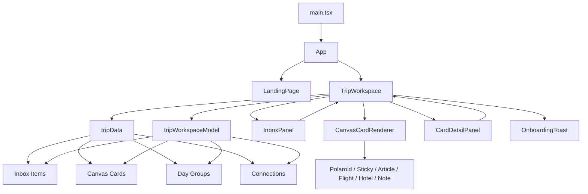

# Codebase Map

This map describes the current Wayfarer prototype at a high level. It uses the domain vocabulary from `CONTEXT.md`.

## Top Layer

`src/App.tsx` is a two-screen router. It switches between the marketing/demo entry screen and the Trip Workspace:

- `landing` renders `LandingPage`
- `app` renders `TripWorkspace`

`src/components/LandingPage.tsx` is mostly a product/demo shell. It animates sample Trip Material and hands off into the Trip Workspace through `onEnterDemo`.

## Domain Model

`src/data/tripData.ts` is the current domain seed. It defines:

- `InboxItem`: raw Trip Material from WhatsApp, links, notes, flights, and hotels
- `CanvasCard`: organized travel objects on the Spatial Canvas
- `DayCluster`: the older day-level itinerary grouping interface
- `inboxItems`, `canvasCards`, `dayGroups`, `connections`: the initial Kyoto trip state

This file is acting as fixture data and as part of the implicit domain schema. New Trip Workspace behavior should prefer the model types in `src/models/tripWorkspaceModel.ts` when describing mutable workspace transitions.

`src/models/tripWorkspaceModel.ts` is the Trip Workspace behavior module. It owns deterministic state transitions that can be tested without rendering React:

- `buildInboxItem`: classifies pasted Trip Material into an Inbox Item.
- `buildProcessedCanvasCard`: marks an Inbox Item processed, creates the corresponding Canvas Card, places it near a Day Label, and returns the optional dynamic Connection.
- `applyAiPromptToTripWorkspace`: applies the mocked AI Prompt effects for Day 5 planning, Arashiyama ryokan suggestions, Gion restaurant suggestions, and fallback AI answer cards.
- `buildManualCanvasCard` and `buildCustomDay`: create user-authored Canvas Cards and Day Groups.
- `getCardCenter`: computes Connection endpoints from Canvas Card dimensions.

`src/models/tripWorkspaceModel.test.ts` contains characterization tests for this module. Those tests are intended to preserve current prototype behavior while the implementation is refactored.

## Main Workspace

`src/components/TripWorkspace.tsx` is the orchestration module. It owns most mutable state:

- viewport state: zoom, pan, and canvas dragging
- trip organization state: Inbox Items, Canvas Cards, Day Groups, Day Labels, and Connections
- interaction state: selected Canvas Card, active Day Group filter, linking mode, create-day/card dialogs
- mocked AI Prompt state

The main flows are:

1. Inbox capture: `handleAddItem` delegates classification to `buildInboxItem`.
2. Inbox organization: `handleProcessItem` delegates Inbox Item promotion to `buildProcessedCanvasCard`.
3. AI Prompt handling: `handleSendQuery` delegates mocked prompt effects to `applyAiPromptToTripWorkspace`.
4. Canvas editing: card selection, drag, update, delete, linking, dialog state, and React event handling remain in `TripWorkspace`.
5. Manual creation: manual Canvas Card and custom Day Group creation delegate their domain object construction to the model.

## Rendering Modules

`src/components/CanvasCards.tsx` is a Canvas Card renderer dispatcher. It converts `CanvasCard.type` into one of six visual shapes:

- `polaroid`
- `sticky`
- `article`
- `flight`
- `hotel`
- `note`

It is presentation-focused and receives card position and drag state from `TripWorkspace`.

`src/components/InboxPanel.tsx` renders the Inbox Item list. It does not own the source of truth; it calls back into `TripWorkspace` through `onAddItem`, `onProcessItem`, and `onOpenAddManual`.

`src/components/CardDetailPanel.tsx` edits the selected Canvas Card. It keeps local edit fields in sync with the selected card, then pushes changes back through `onUpdateCard`.

## Current Shape

The app is currently a Trip Workspace orchestration component plus a small model module and presentation-focused satellites. `TripWorkspace` is still the UI center of gravity: it owns React state, canvas behavior, dialog state, filtering, linking, and event wiring.

The Trip Workspace Model now owns the domain transformations that were previously embedded in `TripWorkspace`: Inbox Item classification, Inbox-to-card promotion, mocked AI Prompt effects, Day Group construction, manual card construction, and Connection geometry. Card linking is still implemented inline in `TripWorkspace` because it is tightly coupled to current click interaction state.

Future refactors should keep behavior-preserving tests around `tripWorkspaceModel` before moving more state transitions out of the component.
