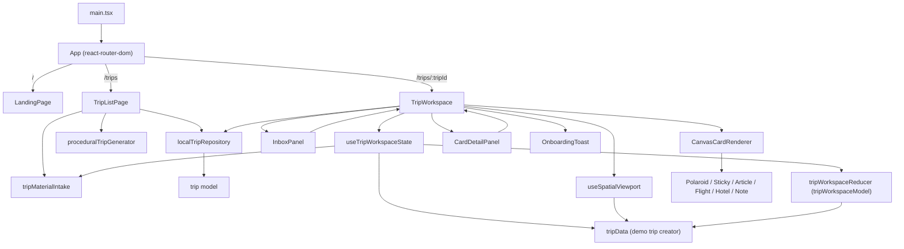

# Codebase Map

This map describes the current Wayfarer prototype at a high level. It uses the domain vocabulary from `CONTEXT.md`.

## Top Layer

`src/App.tsx` is a three-screen router powered by `react-router-dom`. It coordinates screen switches and addressable URL routes:

- `/` renders `LandingPage` (marketing and live chat mockup).
- `/trips` renders `TripListPage` (trip grid, prompt bar for trip creation, and deleting/adding trips).
- `/trips/:tripId` renders `TripWorkspace` (planning workspace for a single trip).

`src/components/LandingPage.tsx` is a product/demo entry point. It animates sample Trip Material and navigates into the Demo Trip workspace via `onEnterDemo`.

`src/components/TripListPage.tsx` lists all active Trips. It provides a prompt bar that detects traveler intents to create a new trip through the Procedural Trip Generator or parse pasted links through Trip Material intake directly into a newly created trip's inbox.

## Persistence & Repository

To enable persistent plans without backend infra, we use a clean repository pattern:

- `src/models/trip.ts`: Defines the unified domain schema for a `Trip` containing its details (id, name, destination, emoji) and workspace data (cards, connections, days, dayLabels, inboxItems).
- `src/models/tripRepository.ts` (`localTripRepository`): Concrete localStorage-based repository implementing list, load, save, and delete operations. It seeds the Kyoto Demo Trip on very first visit.

## Domain Model

`src/data/tripData.ts` defines static Kyoto seed fixtures and the `createDemoTrip()` factory wrapping it.

`src/models/tripMaterialIntake.ts` is the pure Trip Material intake module:

- `buildInboxItem`: classifies pasted Trip Material text into structured Inbox Items.

`src/models/proceduralTripGenerator.ts` is the mocked AI-native Trip creation module:

- `generateTripFromMessage`: translates a conversational prompt into a structured Trip with metadata and starter Canvas Cards.

`src/models/tripWorkspaceModel.ts` is the pure state logic module:

- `tripWorkspaceReducer`: handles semantic transitions (adding inbox items, processing inbox items, custom day groups, card edits, manual cards, and mock AI suggestions).
- `buildProcessedCanvasCard`: handles promoting raw items into canvas cards placed dynamically near their active Day Label coordinates.

## State Coordinator & Viewport Hooks

To decouple rendering layout from state orchestration:

- `src/hooks/useTripWorkspaceState.ts` (`useTripWorkspaceState`): coordinates all state transitions using the pure reducer. It exposes typed callbacks for UI actions.
- `src/hooks/useSpatialViewport.ts` (`useSpatialViewport`): isolates viewport physics, dragging logic, screen-to-canvas coordinate maps, and zoom limits.
- `src/hooks/useLinkingSession.ts` (`useLinkingSession`): encapsulates linking state for manual connection creation.

## Main Workspace

`src/components/TripWorkspace.tsx` is the primary screen coordinator. It loads the requested Trip by ID via `localTripRepository` on mount, mounts state and physics hooks, renders the spatial grid, SVG links, and sub-components, and persists all workspace changes to the repository reactively.
