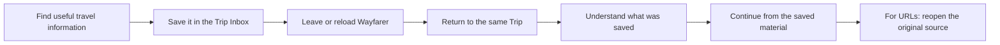

# PRD: Trip Material Capture-and-Return Loop

**Status:** Accepted

**Related issues:** [Capture-and-return validation](https://github.com/caraseli02/ai-travel-spatial-workspace/issues/133), [full-lifecycle Trip Planner](https://github.com/caraseli02/ai-travel-spatial-workspace/issues/23), [Trip Material memory and agent planner foundation](https://github.com/caraseli02/ai-travel-spatial-workspace/issues/24)

## Problem

Budget-conscious travelers often compare many hotels, flights, places, restaurants, and activities before deciding what belongs in a Trip. Useful research becomes scattered across browser tabs, links, and personal notes. When travelers resume planning later, they may not remember what they saved, may lose the original source, or may repeat the same research.

Wayfarer already has a Trip Inbox and localStorage-first Trip persistence, but the first product hypothesis should be smaller than the complete journey from capture to itinerary. Before investing in AI extraction, Spatial Canvas organization, or itinerary generation, Wayfarer needs to show that it can reliably preserve useful Trip Material and help a traveler recover it later.

## Product Hypothesis

If a traveler can quickly save useful Trip Material inside an existing Trip and later recognize and reopen the original source, Wayfarer will reduce lost research and repeated searching.

The first validation tests preservation and recovery. It does not test whether AI can enrich the material or whether the traveler can turn it into a complete plan.

## User

A budget-conscious traveler who is already planning an existing Trip and is comparing options across browser tabs and personal notes. They want a low-friction place to keep promising research before deciding what to do with it.

## Job To Be Done

When I find travel information that may be useful for an existing Trip, I want to save it quickly and return to it later, so I can understand what I found and reopen the original source without repeating my research.

## Validation Loop

## Product Principles

- **Capture must be dependable.** Saving Trip Material must not depend on AI classification, extraction, or an external website request.
- **Preserve what the traveler supplied.** Wayfarer keeps the original text or URL rather than replacing it with an inferred summary.
- **Do not guess.** When a URL has no meaningful label and Wayfarer does not fetch the page, the interface falls back to the source domain and leaves missing context visible.
- **Wayfarer captures; the traveler organizes.** Spatial Canvas promotion, comparison, and itinerary shaping remain later decisions.

## MVP Scope

### Inputs

The first validation supports:

- A pasted URL.
- Pasted or typed text.
- Reservation details when supplied as pasted text.

The traveler captures the material from inside an existing Trip Workspace. The first validation does not decide which Trip an item belongs to and does not create a new Trip from the saved input.

### Save behavior

- Wayfarer saves a non-empty pasted URL or text input immediately as an Inbox Item.
- A URL-only item is accepted even when Wayfarer cannot identify its subject.
- The original URL or text is preserved behind the Trip Repository interface.
- Saving succeeds without AI and without fetching the linked website.
- The traveler may include explanatory text with a URL. When no explanation exists, the source domain is the fallback label.

### Return behavior

After leaving, reloading, or reopening the Trip, the traveler can find the saved Inbox Item in the Trip Inbox.

A URL item shows:

- The traveler's text when provided, otherwise the source domain as a fallback label.
- The original source domain or URL.
- When it was captured.
- An **Open original source** action.

A text-only item shows:

- A preview of the original text.
- When it was captured.
- No source action when no URL exists.

## User Journey

| Phase   | Traveler action                                   | Traveler question              | Wayfarer behavior                                    | Validation signal                                    |
| ------- | ------------------------------------------------- | ------------------------------ | ---------------------------------------------------- | ---------------------------------------------------- |
| Find    | Finds a promising option or useful note.          | Is this worth keeping?         | No action yet.                                       | The material is meaningful enough to revisit.        |
| Save    | Pastes a URL or text into the current Trip Inbox. | Did Wayfarer keep it?          | Saves immediately and preserves the supplied source. | Capture succeeds without assistance or AI.           |
| Leave   | Reloads Wayfarer or leaves the Trip.              | Will this still be here later? | Persists the Inbox Item through the Trip Repository. | Source and traveler text survive reload.             |
| Return  | Reopens the same Trip and scans the Inbox.        | What did I save?               | Shows recognizable source context and capture time.  | Traveler finds the intended item without assistance. |
| Recover | Opens the original source.                        | Can I continue my research?    | Opens the preserved URL.                             | Correct source is recovered.                         |

## Success Criteria

### Primary product criterion

At least four of five usability-test participants can save a URL or note inside an existing Trip, leave or reload Wayfarer, return to the Trip, find the saved Inbox Item, and explain what it represents without assistance. Participants working with a URL can additionally reopen the correct original source.

### Technical guardrail

One hundred percent of source URLs and traveler-supplied text used in the validation survive a Trip Repository save/load round trip unchanged.

### What this validation does not claim

Passing this test shows that the capture-and-return loop is understandable and dependable. It does not demonstrate that travelers want AI extraction, Spatial Canvas organization, comparison, or itinerary generation.

## Validation Protocol

1. Give each participant an existing Trip and one URL or text note relevant to that Trip.
2. Ask them to save the material without step-by-step instruction.
3. Have them reload Wayfarer or leave and reopen the Trip.
4. Ask them to find what they saved and explain what it represents.
5. For URL input, ask them to reopen the original source.
6. Record completion without assistance, failure point, time to recover, and participant comments.

The test should include at least one URL with an opaque path so the domain fallback is exercised.

## Non-Goals

- Screenshot or file upload.
- Browser extensions or operating-system share sheets.
- Fetching, scraping, or summarizing linked websites.
- AI classification, field extraction, confidence scoring, or recommendations.
- External search, booking platforms, or live travel data.
- Selecting a destination or routing captured material between Trips.
- Creating a Trip from captured material.
- Changing the existing `/`, `/trips`, or `/trips/:tripId` routes.
- Review states such as candidate, accepted, or rejected.
- Promoting Inbox Items to Canvas Cards as part of this validation.
- Spatial Canvas organization, comparison, or Day Group assignment.
- Itinerary generation, booking, collaboration, price tracking, or budget optimization.

## Risks

- A URL without traveler-supplied context may be difficult to recognize from its domain alone.
- Travelers may expect Wayfarer to inspect a linked page even though website fetching is out of scope.
- The existing interface may imply AI extraction through labels or progress copy that the validation does not require.
- localStorage proves same-device return behavior only; it does not validate cross-device recovery.
- A successful usability task does not by itself prove repeated real-world usage, so later discovery should observe whether travelers return to saved Trip Material voluntarily.

## Follow-Up Decisions After Validation

If the capture-and-return loop succeeds, follow-up work may test one additional hypothesis at a time:

1. Whether deterministic metadata or AI-generated labels make saved Trip Material faster to recognize.
2. Whether travelers want to edit, remove, or mark saved Inbox Items after capture.
3. Whether promoting saved Trip Material to the Spatial Canvas helps comparison and planning.
4. Whether source-grounded AI assistance improves itinerary decisions.

If the loop fails, investigate the observed failure before adding enrichment or planning features. Likely questions include whether capture is too slow, whether returned items are not recognizable, or whether the Trip Inbox is the wrong recovery surface.

## Relationship To Broader Work

The full-lifecycle Trip Planner remains the product north star. The Trip Material memory and agent planner foundation provides useful technical groundwork, especially durable provenance and Trip Repository persistence. Neither broader effort expands the scope of this validation: the first question is simply whether travelers can save useful Trip Material and recover it later.
